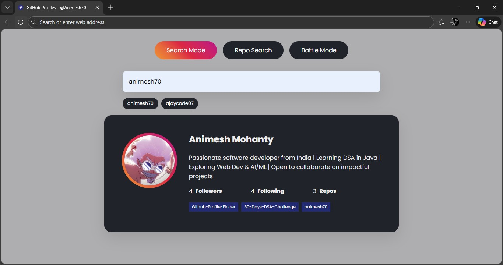
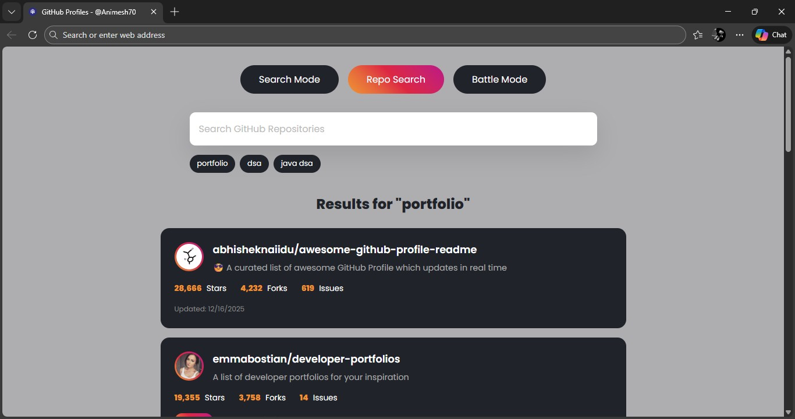
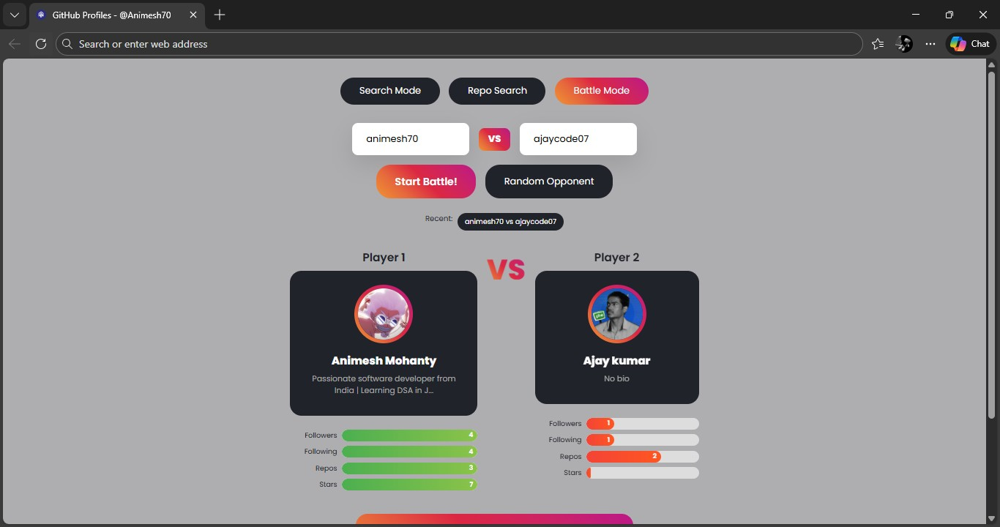

# 🔍 GitHub Profile Finder

<div align="center">
  
</div>

**Discover, Explore, and Connect—a modern, multi-mode tool to look up and compare GitHub user profiles and repositories.**

**Short Description:**
> **GitHub Profile Finder** is a front-end web application (HTML, CSS, JavaScript) that quickly retrieves and displays GitHub profile information, enables repository searching, and offers a fun **Battle Mode** to compare two users' stats, all powered by the GitHub REST API.

[](https://github.com/animesh70/Github-Profile-Finder/issues)
[](https://github.com/animesh70/Github-Profile-Finder/stargazers)
[](https://opensource.org/licenses/MIT)
[](https://developer.mozilla.org/en-US/)

## ✨ Project Preview

A glimpse of the application's various modes, featuring a clean dark theme and a vibrant, gradient-bordered user card design.

| Search Mode (User Card) | Repo Search Mode | Battle Mode (Winner) |
| :---: | :---: | :---: |
|  |  |  |

#### 🎥 Full Walkthrough Video

**[📺 Watch the full walkthrough video on YouTube (Click Here) 🚀](https://www.youtube.com/watch?v=p3RrjKkvQ9E)**

---

## 🚀 Features

* **Instant Search:** Quickly search for any public GitHub profile by entering a valid username.
* **User Profile Card:** Displays the user's name, profile picture, and bio.
* **Key Statistics:** Shows the number of Followers, Following, and Public Repositories.
* **Latest Repos:** Highlights the **5 most recently created** public repositories, directly linking to their source code.
* **Modern UI:** A dark-themed, responsive design, featuring a unique, gradient border around the avatar for a premium look (as seen in `style.css`).
* **Robust Error Handling:** Provides a clear message when a profile cannot be found.

<ins> `The application now supports three distinct modes:` <ins>

#### 1. Search Mode (User Profiles)
* **Instant Search:** Quickly search for any public GitHub profile by entering a valid username.
* **User Profile Card:** Displays the user's name, profile picture, and bio.
* **Key Statistics:** Shows Followers, Following, and Public Repositories.
* **Latest Repos:** Highlights the **5 most recently created** public repositories.
* **Download Card:** Allows downloading the user card as an image.
* **Search History:** Saves recent searches for quick access.

#### 2. Repo Search Mode
* **Repository Search:** Find specific repositories by searching for keywords or names.
* **Repo History:** Stores and displays recent repository search queries.

#### 3. Battle Mode
* **User Comparison:** Enter two GitHub usernames to compare their stats.
* **Random Battle:** Pit two random, famous developers against each other.
* **Stat-Based Scoring:** A winner is determined based on a scoring system derived from user stats.
* **Battle History:** Saves the details of recent battles.
* **Share & Download:** Provides an option to download the battle result as an image or copy a shareable link.
* **Sound Effects & Confetti:** Enhanced user experience with victory sound and confetti upon winning.

---

## 💻 Technologies Used

This project is a pure front-end application, demonstrating solid foundational web development skills:

| Category | Technology | Description |
| :--- | :--- | :--- |
| **Structure** | **HTML5** | Semantic markup for all three mode layouts. |
| **Styling** | **CSS3** | Custom, attractive styling with a dark-mode theme and responsive design. |
| **Logic** | **Vanilla JavaScript** | Handles user input, API calls, dynamic rendering, history management, and the Battle Mode logic. |
| **Data Fetching** | **Axios CDN** | Used for making promise-based HTTP requests to the GitHub API. |
| **Utilities** | **html-to-image** | Used for client-side generation and downloading of user and battle cards. |
| **API** | **GitHub REST API** | The primary data source for fetching user and repository information. |

## ⚙️ Installation & Setup

Since this is a client-side application, getting started is simple. No backend installation is required.

1. **Clone the repository:**
    ```bash
    git clone [https://github.com/animesh70/Github-Profile-Finder.git](https://github.com/animesh70/Github-Profile-Finder.git)
    ```
2. **Navigate to the project directory:**
    ```bash
    cd Github-Profile-Finder
    ```
3. **Open the file:**
    Simply open the `index.html` file in your preferred web browser.
    
    *(e.g., double-click `index.html` or run `open index.html` in your terminal)*

## 💡 Usage

1. Open the application in your web browser.
2. Use the **Mode Toggle** buttons at the top to switch between **Search Mode**, **Repo Search**, and **Battle Mode**.
3. In **Search Mode**, enter a valid GitHub username and press Enter.
4. In **Repo Search**, enter a repository keyword or name and press Enter.
5. In **Battle Mode**, enter two usernames or hit **Random Battle** to start a comparison.

## 🤝 Contributing

Contributions, issues, and feature requests are welcome! Feel free to check [issues page](https://github.com/animesh70/Github-Profile-Finder/issues).

1. Fork the Project
2. Create your Feature Branch (`git checkout -b feature/AmazingFeature`)
3. Commit your Changes (`git commit -m 'Add some AmazingFeature'`)
4. Push to the Branch (`git push origin feature/AmazingFeature`)
5. Open a Pull Request

## 📜 License

Distributed under the MIT License. See `LICENSE` for more information.

---
